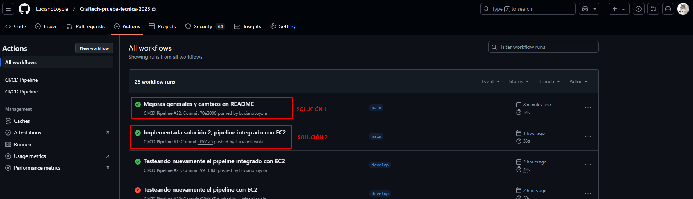
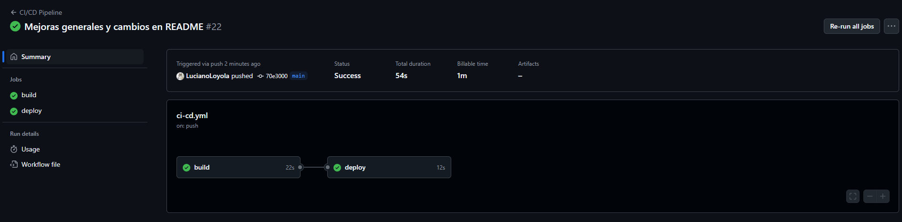
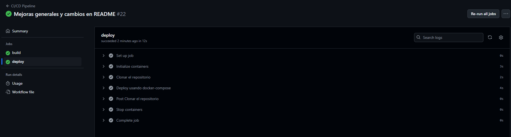
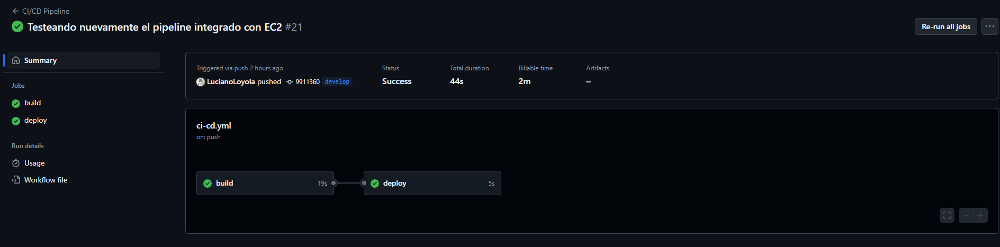
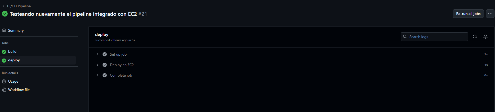
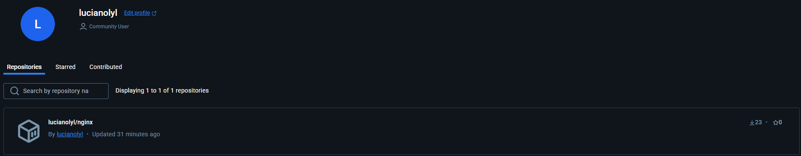

# Prueba 3 - CI/CD
---
## Enunciado
*Dockerizar un nginx con el index.html default. Elaborar un pipeline que ante cada cambio realizado sobre el index.html buildee la nueva imagen y la actualize en la plataforma elegida. (docker-compose, swarm, kuberenetes, etc.) Para la creacion del CI/CD se puede utilizar cualquier plataforma (CircleCI, Gitlab, Github, Bitbucket.)*

*Requisitos y deseables:*
*La solución al ejercicio debe mostrarnos que usted puede:*
*Automatizar la parte del proceso de despliegue. usar conceptos de CI para aprovisionar el software necesario para que los entregables se ejecuten use cualquier herramienta de CI de su elección para implementar el entregable.*

---

## Resolución

Para la resolución del ejercicio, implementé **dos posibles soluciones**. Ambas soluciones están divididas en dos etapas. En ambas soluciones se desarrolló un Pipeline que se ejecuta tras realizar un cambio en el archivo index.html. Los pipelines se dividen en **dos jobs**: Uno para **buildear** la imágen y subirla a Docker Hub y otro para realizar el **deploy** de la imagen en el servidor.

Este es el **esquema** de ambas soluciones propuestas:
**Esquema de los Pipelines:**
- **Etapa 1 - Build**
  - Obtiene el código
  - Configura Docker Buildx
  - Logea a DockerHub
  - Buildea y pushea la imagen
- **Etapa 2 - Deploy**
  - Obtiene el código
  - Realiza el deploy

La etapa de Build es igual en ambas soluciones, pero la etapa de Deploy varía:

En la **Solución 1**, el deploy se hace en el propio **runner del pipeline** con Docker Compose.
En la **Solución 2**, el deploy se hace en una instancia **EC2 de AWS** usando SSH.

Procedo a explicar primero la etapa de Build (común a ambas soluciones)

- **Etapa 1 - Build**
Para la construcción de la imágen Docker utilizo **Docker Buildx**, el cual me facilita el buildeo de la imágen Docker y el pusheo de la misma a Docker Hub. Elegí Docker Buildx porque es una extensión oficial de Docker.

**Solución 1: *ci-cd.yml*** 
La primer solución la implementé de esta manera porque considero que es una solución más **genérica**. En ella, la etapa de Deploy se encarga de obtener el código del repositorio y realizar un docker-compose up para ejecutar el container dentro del ubuntu que se ejecuta en el pipeline.
Evidentemente esta situación no es algo que se realice en la realidad, y su deploy debería de realizarse en la nube, no dentro del pipeline. Eso es que me llevó a implementar la solución 2.

Para ejecutar la solución 1, se necesita tener 2 variables secretos en el repositorio de github.
- **DOCKER_USERNAME**: *usuario de docker hub*
- **DOCKER_PASSWORD**: *contraseña de docker hub*

Cada vez que se modifique el archivo **index.html**, se ejecutará el **pipeline ci-cd.yaml** de la **solución 1.**

**Solución 2: *ci-cd-EC2.yml***
Esta solución está más relacionada a una implementación del mundo real, donde el deploy de la imagen se realiza en una instancia **EC2** corriendo en **AWS**.
Para ello, se deben tener en cuenta los siguientes requisitos:
- Tener establecidas las variables secretas necesarias para la solución 1.
- Crear una instancia EC2
- Crear un key pair a la hora de crear la instancia EC2 
- Obtener la dirección pública de la instancia
- Crear una secret variable en el repositorio de github llamada "**EC2_HOST**" que contenga la dirección pública de la instancia EC2
- Crear una secret variable en el repositorio de github llamada "**EC2_SSH_KEY**" que almacene el contenido del archivo .pem generado al crear la EC2
- Instalar docker en el OS de la instancia EC2

Tras haber seguido correctamente todos los pasos, cada vez que se modifique el archivo **index2.html** el **pipeline ci-cd-EC2.yaml** se encargará de buildear la imágen, subirla a docker hub, conectarse a la instancia **EC2** mediante ssh, obtener la última imágen recientemente subida de Docker Hub y ejecutar el container con la imágen ya modificada.

En entornos reales, los contenedores no suelen desplegarse dentro del runner de CI/CD, sino en servidores en la nube o en Kubernetes. Esta segunda solución refleja mejor un escenario de la realidad.

## Conclusión
Dentro de Github Actions, en el repositorio, se podrán ver los dos pipelines ejecutados con éxito.

Siendo "**Mejoras generales y cambios en README**" la ejecución del **Pipeline de la solución 1** (Deploy en runner)

Siendo "**Implementada solución 2, pipeline integrado con EC2**" la ejecución del **Pipeline de la solución 2** (AWS EC2)

---
## Capturas
**Pipeline de la solución 1** ejecutado tras realizar un cambio en index.html y pusheo a github

**Pipeline de la solución 2** ejecutado tras realizar un cambio en index2.html

Imagen subida a **Docker Hub** mediante los pipelines

---

## Referencias
- *Clase CI/CD Craftech:* https://youtu.be/Nz5FkiTH4iY?si=LNNi03ktvWwAYAg-
- https://github.com/actions/checkout
- https://github.com/docker/setup-buildx-action
- https://github.com/docker/login-action
- https://github.com/docker/build-push-action
- https://github.com/marketplace/actions/docker-compose-action
- https://github.com/appleboy/ssh-action
