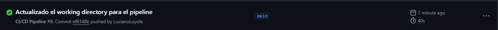
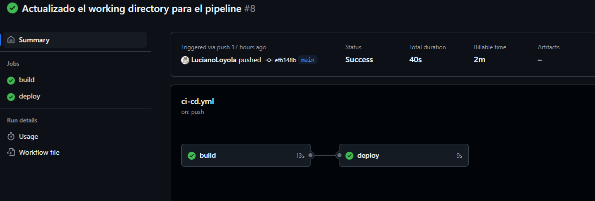

# Prueba 3 - CI/CD
---
## Enunciado
*Dockerizar un nginx con el index.html default. Elaborar un pipeline que ante cada cambio realizado sobre el index.html buildee la nueva imagen y la actualize en la plataforma elegida. (docker-compose, swarm, kuberenetes, etc.) Para la creacion del CI/CD se puede utilizar cualquier plataforma (CircleCI, Gitlab, Github, Bitbucket.)*

*Requisitos y deseables:*
*La solución al ejercicio debe mostrarnos que usted puede:*
*Automatizar la parte del proceso de despliegue. usar conceptos de CI para aprovisionar el software necesario para que los entregables se ejecuten use cualquier herramienta de CI de su elección para implementar el entregable.*

---

## Resolución

Para la resolución del ejercicio, implementé un Pipeline que se ejecuta tras realizar un cambio en el archivo index.html. El Pipeline se divide en **dos jobs**: Uno para **buildear** la imágen y subirla a Docker Hub y otro para realizar el **deploy** de la imagen en el servidor.

Para la construcción de la imágen Docker utilizo **Docker Buildx**, el cual me facilita el buildeo de la imágen Docker y el pusheo de la misma a Docker Hub. Elegí Docker Hub porque es uan extensión oficial de Docker. gfc

Explicación del Pipeline:
- **Etapa 1**
  - Obtiene el código
  - Configura Docker Buildx
  - Logea a DockerHub
  - Buildea y pushea la imagen
- **Etapa 2**
  - Obtiene el código
  - Realiza el deploy

*Nota:* Por simplicidad, realizo el docker-compose up dentro del pipeline. Esta acción podría intercambiarse para realizar la ejecución del docker-compose pero dentro de otra plataforma (por ejemplo, en una instancia de EC2 dentro de AWS, como fue el caso de la prueba 2).

---
## Capturas
*Pipeline ejecutado tras realizar un cambio en index.html y pusheo a github*

---

## Referencias
- *Clase CI/CD Craftech:* https://youtu.be/Nz5FkiTH4iY?si=LNNi03ktvWwAYAg-
- https://github.com/actions/checkout
- https://github.com/docker/setup-buildx-action
- https://github.com/docker/login-action
- https://github.com/docker/build-push-action
- https://github.com/marketplace/actions/docker-compose-action
